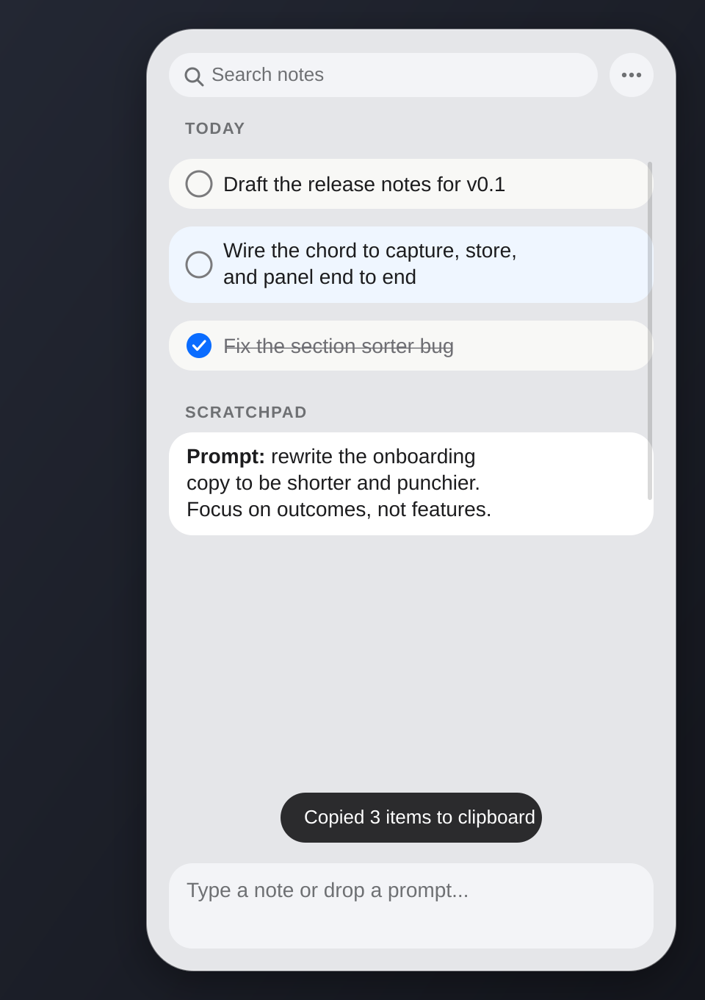

# Ingot

Ingot is a keyboard-first quick-capture panel for Wayland: a to-do list, a clipboard, and a scratchpad for AI-assisted work, always one shortcut away.



## What it does

- Press Shift twice anywhere and your current text selection lands in the panel, no matter what app has focus.
- Type notes and prompts into a composer at the bottom of the panel.
- Organize notes into named sections inside named projects, and tick items off.
- Select several notes and "Copy as List" to put a numbered list on the clipboard, ready to paste into ChatGPT, Claude, or Cursor.
- Everything lives in plain Markdown files on disk. No sync, no account, no telemetry.

## About the original

Ingot is an unofficial reimplementation of [Copper](https://shadcn.com/copper) by shadcn, built for Wayland, a platform the original does not serve. It is not affiliated with or endorsed by him. He built the idea; if you're on a Mac, buy the real thing at shadcn.com/copper.

## Install

### AUR (Arch, Manjaro, EndeavourOS)

```
paru -S ingot
```

### go install

```
go install github.com/Yiin/ingot/cmd/ingot@latest
```

`go install` compiles from source, and the build needs cgo. Make sure you have a C compiler, `pkg-config`, GTK4 development headers, and gtk4-layer-shell development headers first. On Arch: `pacman -S gtk4 gtk4-layer-shell pkgconf gcc`. Ubuntu before 26.04 has neither a new enough GTK4 nor a gtk4-layer-shell package, so this path won't work there yet.

### Build from source

```
git clone https://github.com/Yiin/ingot.git
cd ingot
make build
```

Same dependencies as above: Go 1.25 or newer, a C compiler, `pkg-config`, GTK4 4.22 or newer, and gtk4-layer-shell.

## Setup

Ingot reads your keyboard directly from `/dev/input` to catch the double-tap Shift chord, even when the panel isn't focused. Run:

```
ingot doctor
```

It checks your permissions and installs a udev rule if you're missing one. Be clear about what that rule does: it grants your logged-in session read access to keyboard devices through udev's `uaccess` tag, the same mechanism that already grants you access to your mouse and webcam. systemd's own rules deliberately leave keyboards out of `uaccess`, because reading raw keyboard input is what a keylogger does. Ingot narrows that risk at the read boundary: it reduces every event to "was this Shift, was it something else, and when," never logs or stores key codes, and stops reading while your session is locked.

## Keybinds

Ingot reads the Shift-Shift chord directly from the keyboard, so capture needs no compositor keybind. To show or hide the panel manually, bind a key to `ingot toggle`:

Hyprland (`hyprland.conf`):

```
bind = SUPER, grave, exec, ingot toggle
```

sway (`config`):

```
bindsym $mod+grave exec ingot toggle
```

## Where your notes live

Each project is one Markdown file under `$XDG_DATA_HOME/ingot/projects` (usually `~/.local/share/ingot/projects`). Sections are `##` headings, tasks are `- [ ]` and `- [x]`, and anything else plain is a note. Continuation lines are indented two spaces, which keeps the file readable and means editing it by hand never confuses Ingot.

```markdown
---
ingot: 1
id: 3f2a9c
title: Launch
created: 2026-07-31T09:00:00Z
---

## Today

- [ ] Draft the release notes for v0.1
- [x] Fix the section sorter
- Idea: ship a dark theme before v1
  continuation lines are indented two spaces like this
```

Open it in any editor. Put it in git if you want history. Ingot doesn't need to be running for the file to make sense.

## Why no Flatpak

Hyprland, sway, and niri all block the two protocols Ingot depends on (layer-shell for the panel, data-control for the clipboard) for apps running inside a Flatpak security context. There's no sandboxed build until that changes upstream.

## License

GPL-3.0. See [LICENSE](LICENSE). Copyright (C) 2026 Stanislovas Janonis.
